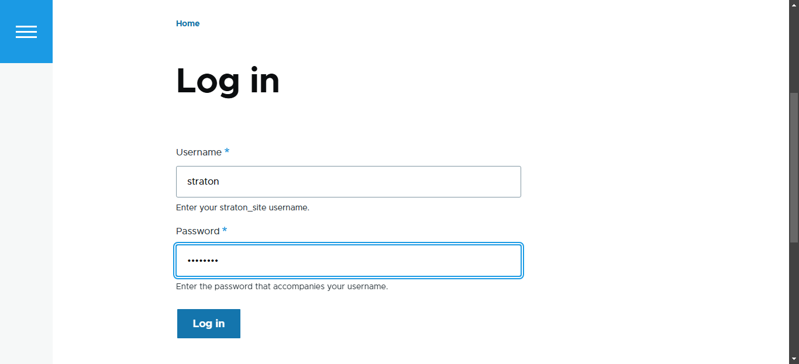

# IWNO1: Server Virtual

* **Autor:** Straton Alexandru
* **Grupa:** IA-2302
* **Data:** 15.02.2025

## Scop
Această lucrare de laborator ne va familariza cu virtualizarea sistemelor de operare și configurarea unui server HTTP virtual.

- În acest laborator, am folosit QEMU pentru a virtualiza un server Debian, unde am instalat și configurat un LAMP stack (Apache, MariaDB, PHP). 

- Am descărcat și configurat phpMyAdmin și Drupal, creând baze de date și utilizatori dedicați. 

- Am setat Virtual Hosts în Apache și am adăugat domeniile în fișierul hosts.

- Am rezolvat probleme legate de versiunea PHP și extensiile necesare pentru Drupal. 

- În final, am testat funcționalitatea serverului accesând interfața phpMyAdmin și Drupal. 


### 1. Descărcarea OS Debian și QEMU

- **Descărcarea OS Debian:**
  Am accesat site-ul oficial [Debian](https://www.debian.org/distrib/) și am descărcat distribuția pentru servere (arhitectură x64, fără interfață grafică).
  

  După finalizarea descărcării, am redenumit fișierul descărcat în `debian.iso`.


- **Descarcarea QEMU:** 
  Am accesat site-ul oficial [QEMU](https://www.qemu.org/download/) și am descărcat versiunea pentru OS Windows.
  

> ! NU UITĂM SĂ ADĂUGĂM PATH - ul UNDE S-A INSTALAT `QEMU` ÎN `ENVIROMENT VARIABLES -> PATH`


### 2. Instalarea OS Debian pe QEMU

- **Structura:**
Am creat directorul `lab01` și, în interiorul acestuia, directorul `dvd`.
```
mkdir lab01
cd lab01
mkdir dvd
```
În interiorul `lab01` am creat un fișier `readme.md`.

```
New-Item -Path "D:\Containerizare\lab01\readme.md" -ItemType File
```

Am mutat fișierul `debian.iso` în folderul `dvd`.

```
Copy-Item -Path C:\Users\Alex\Downloads\debian.iso -Destination D:\Containerizare\lab01\dvd
```
- **Instalarea OS Debian:**

Fiind în folderul `lab01`, am creat un disc virtual de `8 GB` în format `qcow2` folosind comanda:

```
qemu-img create -f qcow2 debian.qcow2 8G

```

Pentru a instala sistemul de operare Debian am executat următoarea comandă:

```
qemu-system-x86_64 -hda debian.qcow2 -cdrom dvd/debian.iso -boot d -m 2G

```


> Instalăm parcugand pașii indicați de instalator.

**În timpul instalării, am introdus următorii parametri:**

  * `Nume calculator: debian`;
  * `Nume domeniu: debian.localhost;`
  * `Nume utilizator: user;`
  * `Parola utilizator: password.`


> ! NU UITĂM SĂ BIFĂM ÎN FEREASTRĂ ALEGERII INTERFEȚEI, DOAR SSH SERVER. 

**După finalizarea instalării, repornim QEMU folosind comanda:**
```
qemu-system-x86_64 -hda debian.qcow2 -m 2G -smp 2 -device e1000,netdev=net0 -netdev user,id=net0,hostfwd=tcp::1080-:80,hostfwd=tcp::1022-:22
```

### 3. Instalarea LAMP 

Pentru a instala și configura pachetele necesare, schimbam profilul utilizatorului la superutilizator (root) și executam următoarele comenzi:

> ! Toate comenzile trebuie sa fie scrise de la superutilizator (root)
```
su
apt update -y
apt install -y apache2 php libapache2-mod-php php-mysql mariadb-server mariadb-client unzip
```

> Care este destinația pachetelor instalate ?

> Pachetele instalate sunt destinate configurării unui server web cu suport pentru PHP și o bază de date MariaDB. Iată scopul fiecărui pachet:

> `apache2` – server web Apache

> `php` – limbajul PHP necesar pentru rularea scripturilor web

> `libapache2-mod-php` – modul Apache care permite interpretarea PHP

 >`php-mysql` – extensie PHP pentru interacțiunea cu baza de date MariaDB/MySQL

> `mariadb-server` – serverul de baze de date MariaDB

> `mariadb-client` – clientul MariaDB pentru administrarea bazei de date

> `unzip` – utilitar pentru extragerea fișierelor din arhive ZIP

### 4. Descărcarea și instalarea phpMyAdmin și CMS Drupal


**Descărcam SGBD PhpMyAdmin:**
```
wget https://files.phpmyadmin.net/phpMyAdmin/5.2.2/phpMyAdmin-5.2.2-all-languages.zip
 ```

**Dezarhivăm fișierele descărcate în directorul:**

`SGBD PhpMyAdmin` ==> `/var/www/phpmyadmin`


```
mkdir /var/www
unzip phpMyAdmin-5.2.2-all-languages.zip
mv phpMyAdmin-5.2.2-all-languages /var/www/phpmyadmin
```


**Descărcam CMS Drupal:**
```
wget https://ftp.drupal.org/files/projects/drupal-10.0.5.zip
```

**Dezarhivăm fișierele descărcate în directorul:**
`CMS Drupal` ==> `/var/www/drupal`


```
unzip drupal-10.0.5.zip
mv drupal-10.0.5 /var/www/drupal
```


> ! Atenție: Setăm ownership - ul pentru foldere:

```
chown -R www-data:www-data /var/www/phpmyadmin
chown -R www-data:www-data /var/www/drupal
```

### 5. Baza de Date

Cream din linia de comandă baza de date `drupal_db` și utilizatorul bazei de date cu numele nostru.

```
mysql -u root
```

```
CREATE DATABASE drupal_db;
CREATE USER 'straton'@'localhost' IDENTIFIED BY 'password';
GRANT ALL PRIVILEGES ON drupal_db.* TO 'straton'@'localhost';
FLUSH PRIVILEGES;
EXIT;
```

### 6. Configurarea Virtual Hosts în Apache

- **Crearea unui fișier de configurare pentru phpMyAdmin**

În directorul `/etc/apache2/sites-available` cream fișierul `01-phpmyadmin.conf`

```
nano /etc/apache2/sites-available/01-phpmyadmin.conf
```

cu următorul conținut:


```
<VirtualHost *:80>
    ServerAdmin webmaster@localhost
    DocumentRoot "/var/www/phpmyadmin"
    ServerName phpmyadmin.localhost
    ServerAlias www.phpmyadmin.localhost
    ErrorLog "/var/log/apache2/phpmyadmin.localhost-error.log"
    CustomLog "/var/log/apache2/phpmyadmin.localhost-access.log" common
</VirtualHost>

```

- **Crearea unui fișier de configurare pentru Drupal**

În directorul `/etc/apache2/sites-available` cream fișierul ` 02-drupal.conf`

```
nano /etc/apache2/sites-available/02-drupal.conf
```

cu următorul conținut:

```
<VirtualHost *:80>
    ServerAdmin webmaster@localhost
    DocumentRoot "/var/www/drupal"
    ServerName drupal.localhost
    ServerAlias www.drupal.localhost
    ErrorLog "/var/log/apache2/drupal.localhost-error.log"
    CustomLog "/var/log/apache2/drupal.localhost-access.log" common
</VirtualHost>
```

- **Activarea Virtual Hosts și repornirea Apache**
```
/usr/sbin/a2ensite 01-phpmyadmin
/usr/sbin/a2ensite 02-drupal

systemctl reload apache2

```


- **Adăugarea domeniilor în fișierul hosts**

```
nano  /etc/hosts
```

> Adăugam în fișierul /etc/hosts următoarele linii:


```
127.0.0.1 phpmyadmin.localhost
127.0.0.1 drupal.localhost
```


### 7. Pornire și Testare

În consolă executam comanda:
```
uname -a
```

> Ce se afișează pe ecran în urma executării acestei comenzi?


**Această ieșire oferă detalii despre:**
* Numele kernelului: `Linux`
* Numele gazdei: `debian`
* Versiunea kernelului: `6.1.0-31-amd64`
* ID-ul build-ului: `#1 SMP PREEMPT_DYNAMIC`
* Distribuția și versiunea Debian:` Debian 6.1.128-1 (2025-02-07)`
* Arhitectura procesorului: `x86_64`
* Tipul sistemului de operare: `GNU/Linux`


**Repornim Apache Web Server.**

```
systemctl reload apache2

```


### 8. Finalizare

> Verificam disponibilitatea site-urilor [Drupal](http://drupal.localhost:1080) și [PhpMyAdmin ](http://phpmyadmin.localhost:1080)


- **PhpMyAdmin**

**Accesăm** [PhpMyAdmin ](http://phpmyadmin.localhost:1080):


> Ne logăm in BD cu user-ul creat.


> Vizualizăm datele.


- **Drupal**

**Accesăm** [Drupal](http://drupal.localhost:1080):


> Setăm limba site-lui


> Alegem profilul dorit


> Requirements problem. Instalăm PHP 8.3

```
add-apt-repository ppa:ondrej/php -y
apt update

apt install php8.3

a2dismod php8.2
a2enmod php8.3

systemctl reload apache2
```


> Requirements problem. Instalăm PHP Extensions

```
apt update
apt install php8.3-xml php8.3-gd
```


> Conectăm BD creată


> Așteptăm să se instaleze Drupal


> Configurăm site-ul


> Site-ul configurat



> Ne logăm cu user-ul si parola, care le-am adaugat la configurare


> Vizualizăm Admin Panel


### 9. Răspunsuri


**1. Cum se poate descărca un fișier în consolă cu ajutorul utilitarului wget?**

*Utilitarul `wget` permite descărcarea fișierelor din rețea prin HTTP, HTTPS sau FTP.*

**Exemplu:**
```
wget https://files.phpmyadmin.net/phpMyAdmin/5.2.2/phpMyAdmin-5.2.2-all-languages.zip
```

**Opțiuni utile:**
- `O <nume_fișier>` → Specifică numele fișierului salvat
- `c` → Continuă descărcarea întreruptă
- `q` → Mod silențios, fără mesaje în consolă
- `r` → Descărcare recursivă

**2. De ce este necesar să creați pentru fiecare site baza de date și utilizatorul său?**

- *Separarea bazelor de date pentru fiecare site oferă securitate și organizare mai bună.*
- *Previne accesul neautorizat între aplicații diferite.*
- *Permite gestionarea mai ușoară a permisiunilor, facilitând backup-ul și restaurarea individuală.*
- *Reduce riscul de corupere a datelor între aplicații.*


**3. Cum se poate schimba accesul la sistemul de gestionare a bazei de date pe portul 1234?**


*Se modifică fișierul de configurare al MariaDB/MySQL:*

```
nano /etc/mysql/mariadb.conf.d/50-server.cnf
```

*Se caută linia:* `port = 3306`


*Se modifică în:* `port = 1234`


*Se repornește serverul de baze de date:* `systemctl restart mariadb`


**4. Care sunt avantajele, din punctul dvs. de vedere, ale virtualizării?**


- **Eficiență:** *Permite utilizarea mai bună a resurselor hardware.*
- **Izolare:** *Fiecare mașină virtuală este independentă, evitând interferențe între servicii.*
- **Flexibilitate:** *Posibilitatea de a testa diferite sisteme de operare și aplicații fără a afecta sistemul gazdă.*
- **Securitate:** *Reducerea riscului de atacuri prin izolarea mediilor de operare.*
- **Recuperare rapidă:** *Crearea și restaurarea de instantanee (snapshots) facilitează backup-ul și revenirea la stări anterioare.*
- 


**5. Pentru ce este necesar să se stabilească ora/zona de timp pe server?**


- *Sincronizarea corectă a log-urilor pentru depanare și analiză.*
- *Evitarea erorilor cauzate de diferențele de timp între server și clienți.*
- *Funcționarea corectă a certificatelor SSL/TLS, care depind de timp.*
- *Corelarea exactă a tranzacțiilor și activităților din baze de date.*

**6. Cât spațiu ocupă instalarea OS (disc virtual) pe mașina gazdă?**

*Discul virtual a fost setat de 8 GB, care folosește formatul qcow2, care alocă spațiu dinamic, reducând ocuparea efectivă a discului fizic. In cazul meu are in jur de 4 GB.*


**7. Care sunt recomandările privind partiționarea discului pentru servere? De ce se recomandă să se particioneze discul în acest fel?**


*Partiționarea corectă îmbunătățește performanța, **securitatea** și **gestionarea** sistemului.*

**Recomandări generale:**
- `/ (root)` – *10-20 GB pentru sistemul de operare*

- `/home` – *Separat pentru utilizatorii normali, protejând datele la reinstalare*
- `/var` –* Stocare pentru log-uri, baze de date și fișiere temporare (10+ GB)*
- `/tmp` – *Director temporar separat pentru securitate și management eficient*
- `swap` – *2x RAM (dacă RAM < 4 GB) sau egal cu RAM (dacă RAM > 4 GB)*


**Avantaje ale partiționării:**

- *Protejează sistemul împotriva umplerii accidentale a spațiului.*
- *Permite reinstalarea OS fără a pierde datele utilizatorilor.*
- *Crește securitatea (de exemplu, noexec pentru `/tmp` împiedică rularea de fișiere malițioase).*


### Concluzie

În cadrul laboratorului, am creat un mediu de lucru pe Windows folosind QEMU pentru virtualizare. Am instalat și configurat Debian, LAMP-stack, PhpMyAdmin și CMS Drupal, documentând fiecare etapă cu capturi de ecran.

Această experiență mi-a consolidat cunoștințele despre virtualizare și administrarea serverelor, oferindu-mi practică valoroasă în gestionarea infrastructurii serverelor și a aplicațiilor web.


### Bibliografie


*1. Curs Moodle USM, Containerizarea și Virtualizarea*

*2. Documentație Debian: https://www.debian.org/doc/*

*3. Documentație QEMU: https://www.qemu.org/documentation/*

*4. Apache HTTP Server Documentation: https://httpd.apache.org/docs/*

*5. MariaDB Knowledge Base: https://mariadb.com/kb/en/*

*6. Drupal Documentation: https://www.drupal.org/docs*

*7. phpMyAdmin Documentation: https://docs.phpmyadmin.net/*