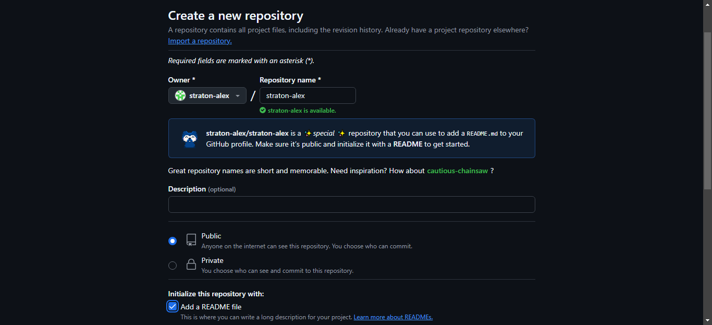

# IWNO2: Lucrul cu GIT

* **Autor:** Straton Alexandru  
* **Grupa:** IA-2302  
* **Data:** 22.02.2025  

## Scop
Familiarizarea cu utilizarea unui sistem de control al versiunilor pentru gestionarea și urmărirea modificărilor codului sursă într-un mediu colaborativ.

### 1. Descărcarea și Instalarea [GIT](https://git-scm.com/downloads)

- **Descărcarea [GIT](https://git-scm.com/downloads) pentru OS Windows**
  - Descărcarea GIT

  Am accesat site-ul oficial [GIT](https://git-scm.com/downloads) și am descărcat `Latest Source Release` pentru OS Windows.

    
    

  După finalizarea descărcării, trecem la instalare.

- **Instalarea [GIT](https://git-scm.com/downloads) pe OS Windows**

  - Instalarea GIT

  > Parcurgem conform pașilor de mai jos

    
    

### 2. Înregistrarea contului [GitHub](https://github.com/)
 - Înregistrarea contului [GitHub](https://github.com/)

  Am accesat site-ul oficial [GitHub](https://github.com/).

    

  > Tastăm pe butonul `Sign up`

    

  > Introducem credențialele contului

    

  > Confirmăm cu adăugarea codului de pe email

    

  > Ne logăm cu login și parolă

    

  Am finalizat crearea contului GitHub.

### 3. Crearea unui proiect
 - Crearea unui *repository* pe GitHub
    - Tastăm butonul `Create repository`  
        

    - Introducem datele repository-ului  
        

### 4. Clonarea repository-ului pe calculatorul local
 1. În repository-ul creat tastăm Code -> Local -> Clone -> HTTPS, copiem link-ul.  
        

 2. Deschidem Visual Studio sau alt IDE dorit.  
        

      > Introducem comanda pentru clonare în consolă

```bash
git clone https://github.com/straton-alex/straton-alex.git
```

  > Creăm o ramură nouă `lab01`

```bash
git checkout -B lab01
```

  > În folderul clonat, creăm alt folder `images`

```bash
mkdir images
```

  3. Redactarea README.md

  > Introducem informație în README.md

  # Hey 👋, I'm Alexandru Straton!

<table>
  <tr>
    <td width="150">
      
    </td>
    <td>
      <h2>Hey 👋, I'm Alexandru Straton!</h2>
      <p>
        I’m an IT student 💻 with a strong motivation to work in the technology and business industry. 
        I'm eager to gain insight and experience in software and web development, networking, and professional growth. 
        I consider myself a curious and passionate learner, always striving to expand my technical skills and knowledge in the field of technology.
      </p>
    </td>
  </tr>
</table>

## 🌟 Areas of Interest
- Software Development
- Database Management
- Cloud Computing

## 💻 Programming Languages
### Languages I Know
<table>
  <tr>
    <td align="center" width="96">
      
      <br>SQL
    </td>
    <td align="center" width="96">
      
      <br>C#
    </td>
    <td align="center" width="96">
      
      <br>Java
    </td>
    <td align="center" width="96">
      
      <br>JavaScript
    </td>
    <td align="center" width="96">
      
      <br>CSS
    </td>
    <td align="center" width="96">
      
      <br>HTML
    </td>
  </tr>
</table>

### Languages I'm Learning
<table>
  <tr>
    <td align="center" width="150">
      
      <br>Spring Framework
    </td>
    <td align="center" width="150">
      
      <br>Python
    </td>
  </tr>
</table>

### Languages I Want to Learn
<table>
  <tr>
    <td align="center" width="150">
      
      <br>Go
    </td>
    <td align="center" width="150">
      
      <br>Rust
    </td>
  </tr>
</table>

## 🛠️ Tools & IDEs
<table>
  <tr>
    <td align="center" width="96">
      
      <br>VS Code
    </td>
    <td align="center" width="96">
      
      <br>Visual Studio
    </td>
    <td align="center" width="96">
      
      <br>Android Studio
    </td>
    <td align="center" width="96">
      
      <br>MySQL Workbench
    </td>
    <td align="center" width="96">
      
      <br>Photoshop
    </td>
    <td align="center" width="96">
      
      <br>Debian
    </td>
  </tr>
</table>

## 📩 Contact Me
<table>
  <tr>
    <td align="left" width="24">
      
    </td>
    <td align="left">
      <a href="mailto:straton.alexandru@usm.md">straton.alexandru@usm.md</a>
    </td>
  </tr>
</table>

### 5. Publicarea codului pe GitHub

> Publicăm codul pe GitHub

```bash
# adăugăm toate fișierele pentru tracking
git add *
# verificăm statusul
git status
# creăm un commit
git commit -m "structure defined"
# împingem commit-ul în repository-ul remote
git push -u origin lab01
# realizăm merge pentru lab01
git merge lab01
# împingem în branch-ul principal
git push origin main
```
  

### 6. Concluzie

Prin această lucrare, am reușit să ne familiarizăm cu utilizarea GIT ca sistem de control al versiunilor și integrarea acestuia cu GitHub pentru gestionarea eficientă a proiectelor. Am parcurs pașii esențiali, de la instalarea și configurarea GIT, crearea și clonarea unui repository, până la editarea unui fișier README.md și publicarea codului pe GitHub.

În plus, am utilizat Visual Studio Code pentru a lucra cu repository-ul local și am aplicat comenzi GIT fundamentale precum `clone`, `checkout`, `commit`, `push` și `merge`. Această experiență contribuie la dezvoltarea abilităților necesare pentru colaborarea eficientă în proiecte software, facilitând versionarea codului și organizarea muncii într-un mediu profesional.

> Link-ul către repository [Alex Straton](https://github.com/straton-alex/straton-alex)

### 7. Bibliografie

*1. Curs Moodle USM, Containerizarea și Virtualizarea*

*2. GitHub Docs – https://docs.github.com/*

*3. Markdown Guide – https://www.markdownguide.org/*