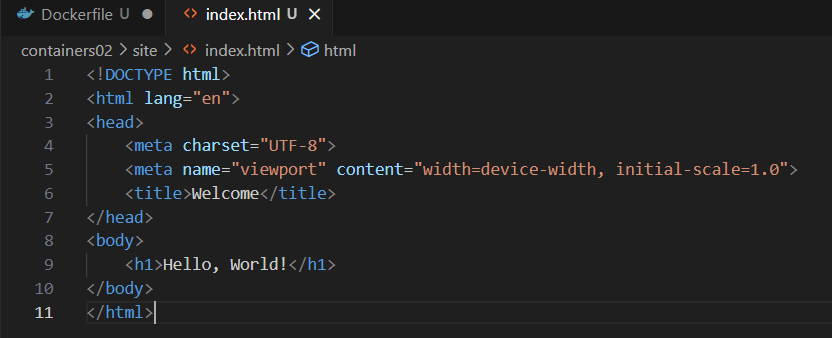

# IWNO3: Prima aplicație Docker

* **Autor:** Straton Alexandru  
* **Grupa:** IA-2302  
* **Data:** 01.03.2025  

## Scop
Scopul acestei lucrări de laborator este de a introduce conceptele de bază ale containerizării cu Docker, de a instala și verifica funcționarea Docker Desktop și de a crea și rula un container simplu.

--- 

### 1. Descărcarea și Instalarea [Docker](https://www.docker.com/products/docker-desktop/)

- **Descărcarea [Docker](https://www.docker.com/products/docker-desktop/) pentru OS Windows**

  - Descărcarea Docker

  Am accesat site-ul oficial [Docker](https://www.docker.com/products/docker-desktop/) și am descărcat `Docker Desktop` pentru OS Windows.

    

  > După finalizarea descărcării, trecem la instalare.

- **Instalarea [Docker](https://www.docker.com/products/docker-desktop/) pe OS Windows**

  - Instalarea Docker

    
  
  > Parcurgem conform pașilor indicați de instalator


```bash
docker --version
```

> După finalizarea instalării, putem verifica versiunea Docker-ului, utilizând comanda


--- 

### 2. Crearea unui proiect
 - Crearea unui *repository* pe GitHub
    - Tastăm butonul `New`  
        

    - Introducem datele repository-ului  
        

--- 

### 3. Clonarea repository-ului pe calculatorul local

 1. În repository-ul creat tastăm Code -> Local -> Clone -> HTTPS, copiem link-ul.  
        

 2. Deschidem Visual Studio sau alt IDE dorit.  
        

 3. Introducem comanda pentru clonare în consolă

```bash
git clone https://github.com/straton-alex/containers02.git

cd containers02
```

--- 

### 4. Lucrul cu Docker

 - Crearea fișierului `Dockerfile`
    - Am utilizat comanda `powershell`  
        

```bash
New-Item -ItemType File -Name "Dockerfile"
```

- Introducem în Dockerfile următoarele date

```bash
FROM debian:latest
COPY ./site/ /var/www/html/
CMD ["sh", "-c", "echo hello from $HOSTNAME"]
```

 - Crearea folderului `site` și fișierului `index.html`

 ```bash
mkdir site
cd site
New-Item -ItemType File -Name "index.html"
 ```

> În interiorul `index.html` am introdus un mesaj de salutare

 

--- 

### 5. Pornire și testare

 - În terminalul directorului containers02 executăm comanda:

```bash
docker build -t containers02 .
```

> Cât timp a durat crearea imaginii?

*Imaginea a fost creată în timp de 43.4 secunde*


 - Pentru a porni containerul utilizăm comanda:

```bash
docker run --name containers02 containers02
```

> Ce a fost afișat în consolă?


*În consolă a fost afișat mesajul de salutare pe care l-am introdus în `Dockerfile` și denumirea containerului*

- Repornirea și verificarea conținutului containerului

  - Ștergem containerul și îl pornim din nou, executând comenzile:

```bash
docker rm containers02
docker run -ti --name containers02 containers02 bash
```

  - În fereastra deschisă, executăm comenzile:

```bash
cd /var/www/html/
ls -l
```

> Ce este afișat pe ecran?


Închidem fereastra cu comanda `exit`.

---

### 6. Publicarea codului pe GitHub

> Publicăm codul pe GitHub

```bash
# adăugăm toate fișierele pentru tracking
git add *
# creăm un commit
git commit -m "lab03"
# împingem în branch-ul principal
git push origin main
```

--- 

### 7. Concluzie

În urma acestei lucrări de laborator, am reușit să instalăm și să configurăm Docker Desktop, să creăm o imagine Docker și să rulăm un container. Am înțeles modul în care funcționează un Dockerfile, gestionarea fișierelor într-un container și interacțiunea cu acesta prin terminal. Această experiență oferă o bază solidă pentru utilizarea containerizării în proiecte viitoare.

--- 

### 8. Bibliografie

*1. Curs Moodle USM, Containerizarea și Virtualizarea*

*2. Documentația oficială Docker – https://docs.docker.com/*

*3. Markdown Guide – https://www.markdownguide.org/*
