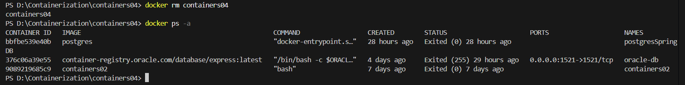

# IWNO4: Utilizarea containerelor ca medii de execuție

* **Autor:** Straton Alexandru  
* **Grupa:** IA-2302  
* **Data:** 08.03.2025  

## Scop
Această lucrare de laborator are ca scop aprofundarea cunoștințelor despre utilizarea containerelor ca medii de execuție, prin configurarea și rularea unui server web Apache într-un container Docker bazat pe imaginea oficială a sistemului de operare Ubuntu. Prin această activitate, se urmărește dezvoltarea abilităților practice în gestionarea containerelor, utilizarea comenzilor de bază Docker și administrarea unui server web într-un mediu izolat.

--- 

### 1. Crearea unui proiect
 - Crearea unui *repository* pe GitHub
    - Tastăm butonul `New`  
        

    - Introducem datele repository-ului  
        

--- 

### 2. Clonarea repository-ului pe calculatorul local

 1. În repository-ul creat tastăm Code -> Local -> Clone -> HTTPS, copiem link-ul.  
        

 2. Deschidem Visual Studio sau alt IDE dorit.  
        

 3. Introducem comanda pentru clonare în consolă

```bash
git clone https://github.com/straton-alex/containers04.git

cd containers04
```

--- 

### 3. Crearea containerul-ui cu Docker

- Deschidem terminalul în directorul `containers04` și executăm comanda:

```bash
docker run -ti -p 8000:80 --name containers04 ubuntu bash
```

> Această comandă creează și rulează un container bazat pe imaginea oficială Ubuntu și oferă un terminal interactiv pentru utilizator. Să analizăm fiecare argument:

> * `docker run`– Creează și rulează un nou container.

> *  `-ti` – Activează un terminal interactiv:

> *  `-t` – Alocă un pseudo-TTY (terminal interactiv).

> *  `-i` – Permite interacțiunea cu terminalul containerului.

> *  `-p 8000:80` – Mapează portul 80 din container (unde rulează Apache) la portul 8000 al sistemului gazdă, permițând accesarea serverului web din browser la `http://localhost:8000`.

> *  `--name` containers04 – Atribuie containerului numele containers04, astfel încât să poată fi gestionat mai ușor (în loc de identificatorul generat automat).

> *  `ubuntu` – Specifică imaginea pe care să se bazeze containerul (în acest caz, imaginea oficială Ubuntu de pe Docker Hub).

> *  `bash `– Specifică comanda care trebuie executată în container. În acest caz, deschide un shell Bash interactiv.


--- 

### 4. Pornire și Testare


1. În fereastra deschisă, executăm următoarele comenzi:

```bash
apt update
apt install apache2 -y
service apache2 start
```
> Explicația comenzilor:
> * `apt update` – Actualizează lista de pachete disponibile din depozitele Ubuntu.

> * `apt install apache2 -y` – Instalează serverul web Apache fără a solicita confirmare (`-y` acceptă automat instalarea).

> * `service apache2 start` – Pornește serviciul Apache, astfel încât serverul web să fie activ în container.

2. Deschidem browser-ul și introducemîn bara de adrese http://localhost:8000


> După ce deschideți browserul și introduceți `http://localhost:8000` în bara de adrese, veți vedea pagina implicită a serverului Apache.

> Aceasta este o pagină standard de test care confirmă funcționarea corectă a serverului Apache. De obicei, afișează mesajul "Apache2 Ubuntu Default Page", împreună cu detalii despre configurarea serverului.


3. Executăm următoarele comenzi:

```bash
ls -l /var/www/html/
echo '<h1>Hello, World!</h1>' > /var/www/html/index.html
```

> Explicația comenzilor:

> * `ls -l /var/www/html/` - Afișează conținutul directorului `/var/www/html/`, unde Apache servește paginile web.
Inițial, acest director conține un fișier implicit, de obicei `index.html`.

> * `echo '<h1>Hello, World!</h1>' > /var/www/html/index.html` - Creează (sau suprascrie) fișierul `index.html` în directorul web cu textul HTML `<h1>Hello, World!</h1>`.

> Acest fișier va deveni pagina principală a serverului Apache.


**! Facem un refresh al paginii în browser.**

> După reîmprospătarea paginii în browser `http://localhost:8000`, pagina implicită `Apache` dispare, fiind înlocuită de un ecran alb cu text mare `"Hello, World!"` afișat ca un titlu.


4. Executăm următoarele comenzi:

```bash
cd /etc/apache2/sites-enabled/
cat 000-default.conf
```

> Explicația comenzilor:
> * `cd /etc/apache2/sites-enabled/` - Această comandă te mută în directorul `/etc/apache2/sites-enabled/,` care conține fișierele de configurare pentru site-urile Apache care sunt activate pe server.

> * `cat 000-default.conf` -  Afișează conținutul fișierului `000-default.conf`, care este fișierul de configurare implicit al site-ului Apache. Acest fișier definește setările pentru serverul web, inclusiv setările pentru hostul virtual și locația fișierelor web.


> Acesta definește setările de bază pentru site-ul Apache, incluzând:

> * `ServerAdmin` – adresa de email a administratorului serverului.
> * `DocumentRoot` – directorul unde Apache caută fișierele de pe site, în acest caz, `/var/www/html`.
> * Setările pentru logurile de eroare și acces.


**! Închidem fereastra terminalului cu comanda `exit`.**

--- 

### 5. Lucrul cu Docker

1. Afișăm lista de containere:

```bash
docker ps -a
```
> Explicația comenzii:
> * `docker ps` - Afișează lista tuturor containerelor Docker, indiferent dacă sunt în execuție sau nu.
> * `-a` (sau `--all`) include toate containerele, inclusiv cele care sunt oprite.


2. Ștergem container-ul:

```bash
docker rm containers04
```

> Explicația comenzii:
> * Această comandă șterge containerul containers04.
> * `rm` (remove) este folosit pentru a elimina un container existent.
> * Dacă containerul este în execuție, comanda va returna o eroare, iar pentru a-l șterge, va trebui să fie mai întâi oprit cu `docker stop containers04`.



--- 

### 6. Publicarea codului pe GitHub

> Publicăm codul pe GitHub

```bash
# adăugăm toate fișierele pentru tracking
git add *
# creăm un commit
git commit -m "lab04"
# împingem în branch-ul principal
git push origin main
```

--- 

### 7. Concluzie

Prin această lucrare de laborator, am învățat cum să utilizăm `Docker` pentru a crea și gestiona containere, precum și cum să instalăm și să configurăm un server web `Apache` într-un mediu izolat. 

Am învățat comenzi esențiale pentru administrarea containerelor, cum ar fi `docker run`, `docker ps -a`, și `docker rm`, care ne permit să creăm, să monitorizăm și să ștergem containere. De asemenea, am observat cum să personalizăm pagina web livrată de `Apache` și să o testăm accesând-o dintr-un browser. Aceste activități ne-au ajutat să înțelegem mai bine procesul de containerizare și cum să gestionăm aplicații web într-un mediu de dezvoltare izolat.


--- 

### 8. Bibliografie

*1. Curs Moodle USM, Containerizarea și Virtualizarea*

*2. Documentația oficială Docker – https://docs.docker.com/*

*3. Markdown Guide – https://www.markdownguide.org/*