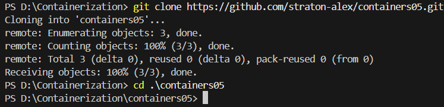
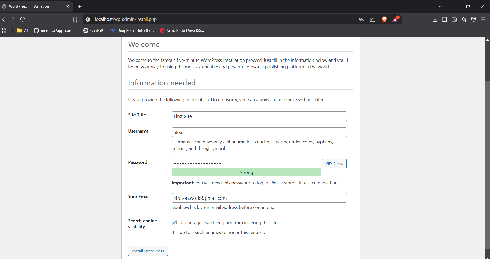

# IWNO5: Rularea site-ului într-un container

* **Autor:** Straton Alexandru  
* **Grupa:** IA-2302  
* **Data:** 22.03.2025  

## Scop
Scopul acestei lucrări este să dezvolți competențe practice în utilizarea Docker pentru a crea și gestiona un mediu complet de aplicații web. Vei învăța să configurezi un container cu `Apache HTTP Server`, `PHP (mod_php)` și `MariaDB`, să instalezi și să configurezi `WordPress`, să gestionezi baze de date folosind volume montate și să expui serverul pe un port specific (8000). Prin această activitate, vei dobândi experiență în integrarea serviciilor esențiale și gestionarea aplicațiilor web într-un mediu containerizat.

## Sarcina
Sarcina include scrierea unui fișier `Dockerfile` pentru a construi imaginea containerului, configurarea fișierelor necesare pentru `Apache`, `PHP` și `MariaDB`, precum și instalarea și configurarea platformei `WordPress`. De asemenea, se vor efectua verificări pentru a asigura funcționarea corectă a site-ului și a componentelor sale. La final,se va documenta procesul și concluziile într-un fișier `README.md `și va încărca proiectul pe `GitHub`.

--- 

### 1. Crearea unui proiect
 - Crearea unui *repository* pe GitHub
    - Tastăm butonul `New`  
        

    - Introducem datele repository-ului  
        

--- 

### 2. Clonarea repository-ului pe calculatorul local

 1. În repository-ul creat tastăm Code -> Local -> Clone -> HTTPS, copiem link-ul.  
        

 2. Deschidem Visual Studio sau alt IDE dorit.  
        

 3. Introducem comanda pentru clonare în consolă

```bash
git clone https://github.com/straton-alex/containers05.git
cd containers05
```

--- 

### 3. Extragerea fișierelor de configurare apache2, php, mariadb din container


1. Creați în folder-ul `containers05` un folder `files`, precum și:

    - folder `files/apache2` - pentru fișierele de configurare apache2;
    - folder `files/php` - pentru fișierele de configurare php;
    - folder `files/mariadb` - pentru fișierele de configurare mariadb.

    ```bash
    mkdir files
    cd files
    mkdir apache2
    mdkir php
    mkdir mariadb
    ```
      

2. Creați în directorul `containers05` fișierul `Dockerfile` cu următorul conținut:

    ```bash
    cd ..
    New-Item -ItemType File -Name "Dockerfile"
    ```
      

    ```bash
    # create from debian image
    FROM debian:latest

    # install apache2, php, mod_php for apache2, php-mysql and mariadb
    RUN apt-get update && \
        apt-get install -y apache2 php libapache2-mod-php php-mysql mariadb-server && \
        apt-get clean
    ```

3. Construiți o imagine a containerului cu numele `apache2-php-mariadb`.

    ```bash
    docker build -t apache2-php-mariadb
    ```
      

4. Creați un container `apache2-php-mariadb` din imaginea `apache2-php-mariadb` și porniți-l în modul de fundal cu comanda `bash`.

    ```bash
    docker run -d --name apache2-php-mariadb apache2-php-mariadb bash
    ```
      


5. Copiați din container fișierele de configurare `apache2`, `php`, mariadb în directorul `files/` de pe computer. 

    > Pentru a face acest lucru, în contextul proiectului, executați comenzile:
    ```bash
    docker cp apache2-php-mariadb:/etc/apache2/sites-available/000-default.conf files/apache2/
    docker cp apache2-php-mariadb:/etc/apache2/apache2.conf files/apache2/
    docker cp apache2-php-mariadb:/etc/php/8.2/apache2/php.ini files/php/
    docker cp apache2-php-mariadb:/etc/mysql/mariadb.conf.d/50-server.cnf files/mariadb/
    ```
      


- După executarea comenzilor, în directorul `files/` ar trebui să apară fișierele de configurare `apache2`, `php`, `mariadb`.

    - Verificați dacă acestea există. 

        ```bash
        Get-ChildItem -Path . -Recurse
        ```
          


    - Opriți și ștergeți containerul `apache2-php-mariadb`.

        ```bash
        docker stop apache2-php-mariadb
        docker rm apache2-php-mariadb
        ```
          


        > Putem verifica cu comanda:

        ```bash
        docker ps -a
        ```
          
--- 

### 4. Configurarea


**1. Fișierul de configurare `apache2`**

- Deschideți fișierul `files/apache2/000-default.conf`, găsiți linia `#ServerName www.example.com` și înlocuiți-o cu `ServerName localhost`.

- Găsiți linia `ServerAdmin webmaster@localhost` și înlocuiți adresa de e-mail cu a dvs.

- După linia `DocumentRoot /var/www/html` adăugați următoarea linie:

    ```bash
    DirectoryIndex index.php index.html
    ```
      
    **Salvați fișierul și închideți-l.**


- La sfârșitul fișierului `files/apache2/apache2.conf` adăugați următoarea linie:

    ```bash
    ServerName localhost
    ```
      


**2. Fișierul de configurare `php`**

- Deschideți fișierul `files/php/php.ini`, găsiți linia `;error_log = php_errors.log` și înlocuiți-o cu `error_log = /var/log/php_errors.log`.

      

- Setați parametrii `memory_limit`, `upload_max_filesize`, `post_max_size` și `max_execution_time` astfel:

    ```bash
    memory_limit = 128M
    upload_max_filesize = 128M
    post_max_size = 128M
    max_execution_time = 120
    ```
             

    **Salvați fișierul și închideți-l.**

**3. Fișierul de configurare `mariadb`**

- Deschideți fișierul `files/mariadb/50-server.cnf`, găsiți linia `#log_error = /var/log/mysql/error.log` și eliminați `#` din fața ei.

      
    **Salvați fișierul și închideți-l.**
--- 

### 5. Crearea scriptului de pornire

1. În directorul `files` creați directorul `supervisor` si fișierul `supervisord.conf`, 

    ```bash
    mkdir supervisor
    cd supervisor
    New-Item -ItemType File -Name "supervisord.conf"
    ```
      

    cu urmatorul continut:

    ```bash
    [supervisord]
    nodaemon=true
    logfile=/dev/null
    user=root

    # apache2
    [program:apache2]
    command=/usr/sbin/apache2ctl -D FOREGROUND
    autostart=true
    autorestart=true
    startretries=3
    stderr_logfile=/proc/self/fd/2
    user=root

    # mariadb
    [program:mariadb]
    command=/usr/sbin/mariadbd --user=mysql
    autostart=true
    autorestart=true
    startretries=3
    stderr_logfile=/proc/self/fd/2
    user=mysql
    ```

2. Crearea Dockerfile

- Deschiți fișierul `Dockerfile` și adăugați următoarele linii:
  - după instrucția `FROM ...` adăugați montarea volumelor:

    ```bash
    # mount volume for mysql data
    VOLUME /var/lib/mysql

    # mount volume for logs
    VOLUME /var/log
    ```

   - în instrucția `RUN ...` adăugați instalarea pachetului `supervisor`.

   - după instrucția `RUN ...` adăugați copierea și dezarhivarea site-ului `WordPress`:
        ```bash
        # add wordpress files to /var/www/html
        ADD https://wordpress.org/latest.tar.gz /var/www/html/
        ```

  - după copierea fișierelor `WordPress` adăugați copierea fișierelor de configurare `apache2`, `php`, `mariadb`, așa cum și a scriptului de pornire:

    ```bash
    # copy the configuration file for apache2 from files/ directory
    COPY files/apache2/000-default.conf /etc/apache2/sites-available/000-default.conf
    COPY files/apache2/apache2.conf /etc/apache2/apache2.conf

    # copy the configuration file for php from files/ directory
    COPY files/php/php.ini /etc/php/8.2/apache2/php.ini

    # copy the configuration file for mysql from files/ directory
    COPY files/mariadb/50-server.cnf /etc/mysql/mariadb.conf.d/50-server.cnf

    # copy the supervisor configuration file
    COPY files/supervisor/supervisord.conf /etc/supervisor/supervisord.conf
    ```

  - pentru functionarea `mariadb` creati directorul `/var/run/mysqld` si setati permisiile pe el:
    ```bash
    # create mysql socket directory
    RUN mkdir /var/run/mysqld && chown mysql:mysql /var/run/mysqld
    ```

  - deschideți portul `80`.
    ```bash
    EXPOSE 80
    ```

  - adăugați comanda de pornire supervisord:

    ```bash
        # start supervisor
        CMD ["/usr/bin/supervisord", "-n", "-c", "/etc/supervisor/conf.d/supervisord.conf"]
    ```

- Creați imaginea containerului cu numele `apache2-php-mariadb` și porniți containerul `apache2-php-mariadb` din imaginea `apache2-php-mariadb`.

    ```bash
    cd ..
    docker build -t apache2-php-mariad .
    ```
     
    ```bash
    docker run -d --name apache2-php-mariadb -p 80:80 apache2-php-mariadb
    ``` 
      

- Verificați dacă site-ul `WordPress` este disponibil la adresa `http://localhost/`.
    


- Verificați dacă in directorul `/var/www/html/` există fișierele site-ului `WordPress`. 

    ```bash
    docker exec -it apache2-php-mariadb bash
    ```
    > În interiorul consolei, introducem comanda:
    ```bash
    ls -l /var/www/html/
    ```
    

- Verificați dacă fișierele de configurare `apache2`, `php`, `mariadb` sunt modificate.

    ```bash
    cat /etc/apache2/sites-available/000-default.conf
    ```
    
--- 

### 6. Crearea bazelor de date și a utilizatorului pentru WordPress

- Crearea bazelor de date și a utilizatorului pentru `WordPress` se face în containerul `apache2-php-mariadb`. Pentru a face acest lucru, conectați-vă la containerul `apache2-php-mariadb`,
    
    > Dacă nu suntem în bash deja, executăm comanda:    
    ```bash
    docker exec -it apache2-php-mariadb bash
    ```

    și executați comenzile:

    ```bash
    mysql

    CREATE DATABASE wordpress;
    CREATE USER 'wordpress'@'localhost' IDENTIFIED BY 'wordpress';
    GRANT ALL PRIVILEGES ON wordpress.* TO 'wordpress'@'localhost';
    FLUSH PRIVILEGES;
    EXIT;
    ```
    

- Crearea fișierului de configurare `WordPress`

    - Deschideți în browser site-ul WordPress la adresa `http://localhost/` și urmați instrucțiunile pentru instalarea site-ului `WordPress`. La pasul 2, specificați următoarele date:

        - *Numele bazei de date: `wordpress`;*
        - *Utilizatorul bazei de date: `wordpress`;*
        - *Parola bazei de date: `wordpress`;*
        - *Adresa bazei de date: `localhost`;*
        - *Prefixul tabelelor: `wp_`.*

    
    
    

    Din urmatorul pas copiați conținutul fișierului `wp-config.php` și salvați-l în fișierul `files/wp-config.php`.

    ```bash
    cd .\containers05\files
    New-Item -ItemType File -Name "wp-config.php"
    ```
    

    > Copiem in fisierul dat datele din `wp-config.php`, de pe `localhost`

- Adăugarea fișierului de configurare `WordPress` în `Dockerfile`

    ```bash
    # copy the configuration file for wordpress from files/ directory
    COPY files/wp-config.php /var/www/html/wordpress/wp-config.php
    ```
    
--- 

### 7. Pornirea și Testarea
- Recreați imaginea containerului cu numele `apache2-php-mariadb` și porniți containerul `apache2-php-mariadb` din `imaginea apache2-php-mariadb.` 

    ```bash
    cd ..
    docker stop apache2-php-mariadb
    docker rm apache2-php-mariadb
    docker rmi apache2-php-mariadb
    docker build -t apache2-php-mariadb .
    ```
    

    ```bash
    docker run -d --name apache2-php-mariadb -p 80:80 apache2-php-mariadb
    ```
    

- Verificați funcționarea site-ului WordPress.

    - Let's go!
    
    - Eroare de conectiune la BD
    
        > În caz că primim eroare de acest tip, este nevoie de recreat baza de date din punctul 6 (Crearea bazelor de date și a utilizatorului pentru WordPress)

    - Introducerea informatiei
    
    - Success!
    
    - Pagina principala default creata de WordPress.
    
    - Incercam sa ne logam cu credintialele adaugate la configurare.
    
    - Dashboard-ul unde putem configura site-ul.
    
--- 

### 8. Publicarea codului pe GitHub

> Publicăm codul pe GitHub

```bash
# adăugăm toate fișierele pentru tracking
git add *
# creăm un commit
git commit -m "lab05"
# împingem în branch-ul principal
git push origin main
```

--- 

### 9. Răspunsuri la întrebări

**1. Ce fișiere de configurare au fost modificate?**

Fișierele de configurare modificate în cadrul acestei lucrări sunt:

- Apache HTTP Server
    - `files/apache2/000-default.conf` – configurarea `VirtualHost` (ex.: ServerName localhost).
    - `files/apache2/apache2.conf` – adăugarea directivelor necesare (ex.: ServerName localhost).

- PHP
    - `files/php/php.ini` – modificarea parametrilor de configurare pentru performanță și logare (ex.: `error_log`, `memory_limit`, `upload_max_filesize`, `post_max_size`, `max_execution_time`).

- MariaDB
    - `files/mariadb/50-server.cnf` – activarea logării erorilor (`log_error = /var/log/mysql/error.log`).

- Supervisor
    - `files/supervisor/supervisord.conf` – configurarea proceselor de pornire a serviciilor `Apache` și `MariaDB`.

- WordPress
    - `files/wp-config.php` – configurarea bazei de date pentru `WordPress` (ex.: nume bază de date, utilizator, parolă).

**2. Pentru ce este responsabilă instrucția `DirectoryIndex `din fișierul de configurare `apache2`?**

Instrucția `DirectoryIndex` din fișierul de configurare `Apache` (`apache2.conf` sau `000-default.conf`) specifică fișierele care vor fi servite automat atunci când un utilizator accesează un director din serverul web, fără a specifica un fișier anume.

În cazul acestei lucrări, instrucția:

```bash
DirectoryIndex index.php index.html
```

indică faptul că Apache va căuta mai întâi fișierul `index.php`, iar dacă acesta nu există, va încerca să servească `index.html`. Acest lucru este util în special pentru rularea `WordPress`, unde pagina principală este un fișier `PHP`.


**3. De ce este necesar fișierul `wp-config.php`?**

Fișierul `wp-config.php` este esențial pentru funcționarea `WordPress` deoarece conține setările de bază necesare pentru conectarea la baza de date și configurarea site-ului.

- Rolul fișierului wp-config.php:
    - **Conectarea la baza de date** – conține detaliile necesare pentru ca `WordPress` să poată accesa baza de date:
    - **Setările de securitate** – include chei de autentificare și săruri pentru protejarea sesiunilor utilizatorilor.
    - **Prefixul tabelelor** – definește prefixul folosit pentru tabelele bazei de date (`$table_prefix = 'wp_';`), permițând instalarea mai multor site-uri `WordPres`s în aceeași bază de date.
    - **Opțiuni suplimentare** – poate conține setări pentru depanare (`WP_DEBUG`), `cache`, setări pentru conexiunea la fișiere și alte configurații avansate.

Fără acest fișier, WordPress nu ar putea funcționa corect, deoarece nu ar avea acces la baza de date și nu ar putea stoca sau prelua informații esențiale, cum ar fi utilizatorii, postările și setările site-ului.

**4. Pentru ce este responsabil parametrul `post_max_size` din fișierul de configurare php?**

Parametrul `post_max_size` din fișierul de configurare `php.ini` determină dimensiunea maximă a datelor care pot fi trimise printr-o solicitare `HTTP` de tip `POST`.

- Rolul parametrului `post_max_size`:
    - **Limitează dimensiunea totală a datelor transmise prin `POST`** – afectează formularele web care trimit date, inclusiv încărcările de fișiere și submisiile de formulare mari.

    - **Afectează funcționarea `WordPress`** – limitează dimensiunea fișierelor încărcate prin `Media Uploader`.

    - **Trebuie să fie mai mare sau egal cu `upload_max_filesize`** – pentru a permite încărcarea fișierelor mari:
        ```bash
        post_max_size = 128M
        upload_max_filesize = 128M
        ```
    - **Poate afecta performanța serverului** – setarea unei valori prea mari poate duce la utilizare excesivă a memoriei și resurselor serverului.

Dacă acest parametru este prea mic, încărcările mari de fișiere sau formularele extinse pot eșua, returnând erori de tip `"Request Entity Too Large"` sau `"413 Payload Too Large"`.

**5. Specificați, în opinia dvs., care sunt deficiențele imaginii containerului creat?**

- Imaginea containerului creat prezintă câteva deficiențe:

    - **Dimensiune mare**– Se instalează `Apache`, `PHP` și `MariaDB` într-un singur container. 
    **Soluție**: Separarea serviciilor și utilizarea unei imagini mai mici (ex. debian:slim).

    - **Lipsa optimizării** – `PHP` nu are `opcache`, iar resursele nu sunt limitate. 
    **Soluție**: Activarea cache-ului și optimizarea configurărilor.

    - **Securitate slabă** – Datele bazei de date sunt expuse în `wp-config.php`, iar serviciile rulează ca `root`. **Soluție**: Utilizarea unui utilizator non-root și variabile de mediu.

    - **Porturi deschise fără protecție** – Portul `80` expus direct. 
    **Soluție**: Adăugarea unui firewall sau proxy invers (ex. `Nginx`).

    - **Lipsa backup-ului** – Baza de date nu are un mecanism de backup automat. 
    **Soluție**: Adăugarea unui script de backup.

Containerul funcționează, dar poate fi îmbunătățit prin optimizare, securizare și separarea serviciilor.

--- 
### 10. Concluzie

În această lucrare, am construit un container `Docker` care găzduiește un site `WordPress` folosind `Apache`, `PHP` și `MariaDB`. Am configurat fișierele necesare pentru `Apache`, `PHP` și `MariaDB` și am instalat `WordPress`. Am ajustat setările de memorie, dimensiunea fișierelor încărcate și logarea erorilor, iar cu ajutorul `supervisor` am asigurat rularea serviciilor în fundal. La final, site-ul `WordPress` a fost disponibil și funcțional. Această lucrare a oferit o înțelegere practică a utilizării `Docker` pentru a configura un mediu de dezvoltare complet pentru aplicațiile web.

--- 

### 11. Bibliografie

*1. Curs Moodle USM, Containerizarea și Virtualizarea*

*2. Documentația oficială Docker – https://docs.docker.com/*

*3. Apache HTTP Server Documentation. Apache HTTP Server Configuration – https://httpd.apache.org/docs/*

*4. PHP Manual. PHP Configuration – https://www.php.net/manual/en/*

*5. MariaDB Documentation. MariaDB Server Configuration – https://mariadb.com/kb/en/documentation/*

*6. Markdown Guide – https://www.markdownguide.org/*
