# IWNO6: Interacțiunea containerelor

* **Autor:** Straton Alexandru  
* **Grupa:** IA-2302  
* **Data:** 05.04.2025  

## Scop
Scopul acestei lucrări este de a dezvolta competențele studentului în gestionarea interacțiunii între mai multe containere Docker. La finalizarea lucrării, studentul va înțelege cum să configureze o aplicație web bazată pe containere, să stabilească comunicarea între acestea și să asigure funcționarea corectă a unui site PHP utilizând Nginx și PHP-FPM.

## Sarcina
Sarcina constă în crearea unei aplicații `PHP` funcționale utilizând două containere `Docker`:
- Un container `(frontend)` `Nginx` care servește fișiere statice și direcționează cererile `PHP`.
- Un container `(backend)` `PHP-FPM` care procesează codul `PHP`.
Aplicația trebuie să fie configurată astfel încât cele două containere să comunice printr-o rețea internă, iar site-ul să fie accesibil pe portul `80` al gazdei.

--- 

### 1. Crearea unui proiect
 - Crearea unui *repository* pe GitHub
    - Tastăm butonul `New`  
        

    - Introducem datele repository-ului  
      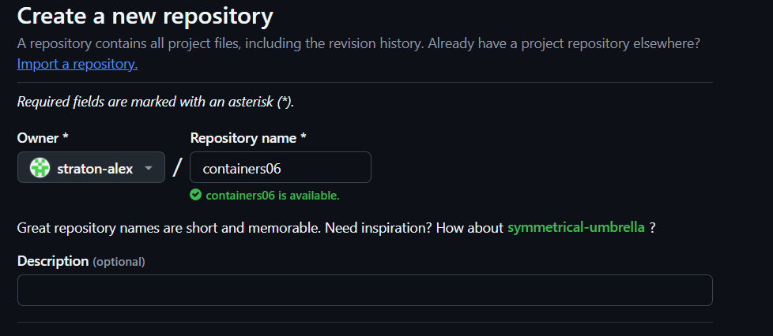  

--- 

### 2. Clonarea repository-ului pe calculatorul local

 1. În repository-ul creat tastăm Code -> Local -> Clone -> HTTPS, copiem link-ul.  
      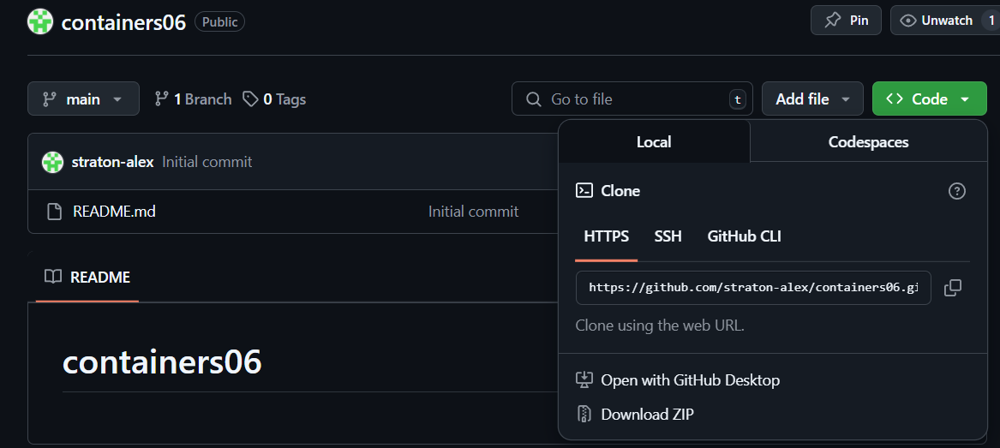  

 2. Deschidem Visual Studio sau alt IDE dorit.  
      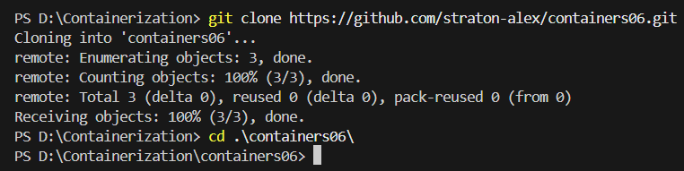  

 3. Introducem comanda pentru clonare în consolă

    ```bash
    git clone https://github.com/straton-alex/containers06.git
    cd containers06
    ```

--- 

### 3. Structura Proiectului

**1. Crearea structurii proiectului**
- Creează directorul principal al proiectului și subdirectoarele necesare:
    ```bash
    mkdir mounts
    cd mounts
    mkdir site
    ```
    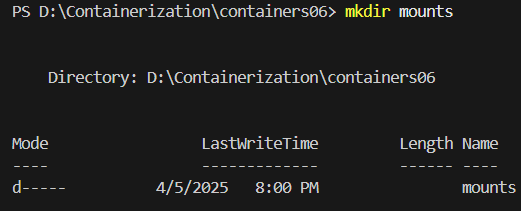  
    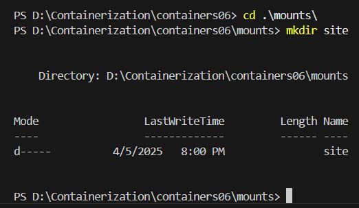  

- Directorul `mounts\site` va conține fișierele site-ului PHP. Copiază aici site-ul creat în cursul `„Programare PHP”`. Dacă nu ai un site, creează un fișier de test:

    ```bash
    echo '<?php phpinfo();' > mounts/site/index.php
    ```
    > Acest fișier simplu afișează informații despre configurația PHP, fiind util pentru testare.

**2. Configurarea .gitignore**

- Creează fișierul `.gitignore` pentru a exclude fișierele site-ului din controlul versiunii:

    ```bash
    cd ..
    New-Item -ItemType File -Name ".gitignore"
    ```
    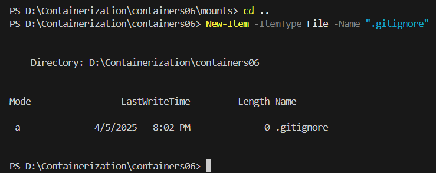  

    și adăugați următoarele linii:

    ```bash
    # Ignore files and directories
    mounts/site/*
    ```
    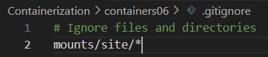  

**3. Configurarea Nginx**

- Creați în directorul `containers06` fișierul `nginx/default.conf`
    ```bash
    mkdir nginx
    cd nginx
    New-Item -ItemType File -Name "default.conf"
    ```
    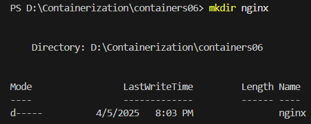  
    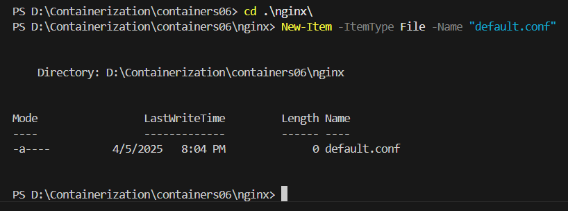 

    cu următorul conținut:

    ```bash
    server {
        listen 80;
        server_name _;
        root /var/www/html;
        index index.php;
        location / {
            try_files $uri $uri/ /index.php?$args;
        }
        location ~ \.php$ {
            fastcgi_pass backend:9000;
            fastcgi_index index.php;
            fastcgi_param SCRIPT_FILENAME $document_root$fastcgi_script_name;
            include fastcgi_params;
        }
    }
    ```
    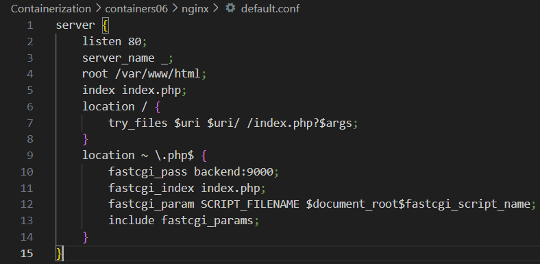 


    - **Explicație**:
        - `listen 80`: Nginx ascultă pe portul 80.
        - `root /var/www/html\`: Setează directorul rădăcină al site-ului.
        - `index index.php`: Definește fișierul implicit ca fiind `index.php`.
        - `location /`: Gestionează cererile pentru fișiere statice sau redirecționează către PHP.
        - `location ~ \.php$`: Configurează procesarea fișierelor PHP prin `FastCGI`, trimițând cererile către containerul `backend` pe portul `9000`.

---
### 4. Crearea rețelei interne
- Creează o rețea Docker de tip `„bridge”` numită `internal`:

    ```bash
    docker network create internal
    ```

    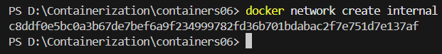 

    > Această rețea permite containerelor să comunice între ele într-un mediu izolat, fără a expune porturile inutil către gazdă.

---
### 5. Lansarea containerului backend (PHP-FPM)

- Creați containerul backend cu următoarele proprietăți:
    - pe baza imaginii `php:7.4-fpm`;
    - directorul `mounts/site` este montat în `/var/www/html`;
    - funcționează în rețeaua `internal`.
    </br>


- Rulează containerul PHP-FPM:

    ```bash
    docker run -d --name backend --network internal -v ${PWD}/mounts/site:/var/www/html php:7.4-fpm
    ```
    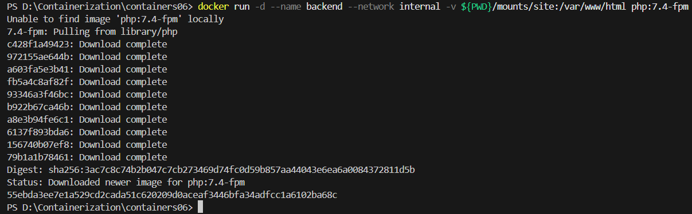 

---
### 6. Lansarea containerului frontend (Nginx)

- Creați containerul frontend cu următoarele proprietăți:

    - pe baza imaginii `nginx:1.23-alpine`;
    - directorul `mounts/site` este montat în `/var/www/html`;
    - fișierul `nginx/default.conf` este montat în `/etc/nginx/conf.d/default.conf`;
    - portul `80` al containerului este expus pe portul `80` al calculatorului gazdei;
    - funcționează în rețeaua `internal`.
    </br>

- Rulează containerul Nginx:

    ```bash
    docker run -d --name frontend --network internal -v ${PWD}/mounts/site:/var/www/html -v ${PWD}/nginx/default.conf:/etc/nginx/conf.d/default.conf -p 80:80 nginx:1.23-alpine
    ```
    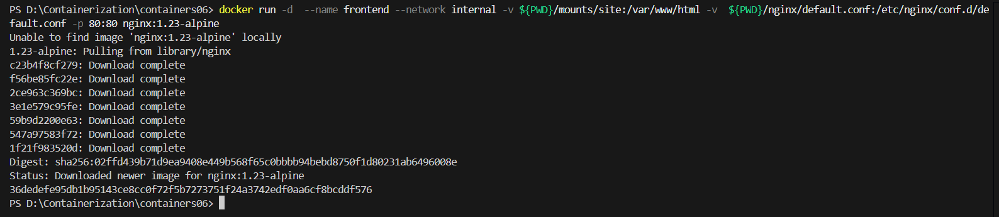 

### 7. Testarea aplicației
- Verifică starea containerelor:

    ```bash
    docker ps
    ```
    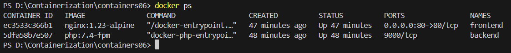 
    </br>
- Deschide un browser și accesează `http://localhost`. Dacă apare pagina implicită `Nginx`, reîncarcă pagina pentru a vedea rezultatul `PHP`

    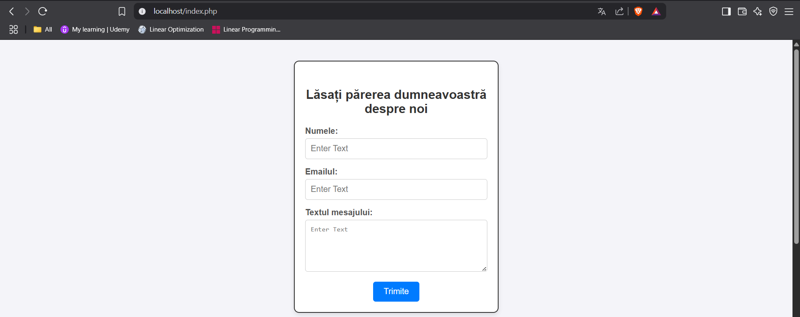 

### 8. Publicarea codului pe GitHub

> Publicăm codul pe GitHub

```bash
# adăugăm toate fișierele pentru tracking
git add .
# creăm un commit
git commit -m "lab06"
# împingem în branch-ul principal
git push origin main
```

--- 

### 9. Răspunsuri la întrebări

1. **În ce mod în acest exemplu containerele pot interacționa unul cu celălalt?**

    - Containerele interacționează prin rețeaua Docker `internal` utilizând protocolul FastCGI. Containerul `frontend` (Nginx) servește fișiere statice direct din directorul montat (`/var/www/html`), dar când întâlnește un fișier PHP, trimite cererea către containerul `backend` (PHP-FPM) prin adresa `backend:9000`. PHP-FPM procesează codul PHP și returnează rezultatul către Nginx, care apoi îl afișează utilizatorului. Această comunicare este posibilă datorită rețelei comune și configurației FastCGI din `default.conf`.

2. **Cum văd containerele unul pe celălalt în cadrul rețelei internal?**

   - În rețeaua `internal`, Docker configurează un sistem DNS intern care rezolvă automat numele containerelor. Containerul `frontend` poate accesa containerul `backend` folosind numele acestuia (`backend`) în loc de o adresă IP. De exemplu, în configurația Nginx, `fastcgi_pass backend:9000` indică faptul că cererile sunt trimise către containerul numit `backend` pe portul `9000`. Această rezoluție a numelor este gestionată de Docker și funcționează doar în interiorul aceleiași rețele definite de utilizator.

3. **De ce a fost necesar să se suprascrie configurarea Nginx?**

   - Configurația implicită a imaginii `nginx:1.23-alpine` este proiectată să servească doar fișiere statice (ex. HTML) și nu include suport pentru procesarea fișierelor PHP sau comunicarea cu PHP-FPM. Suprascrierea fișierului `default.conf` a fost necesară pentru a:
     - Seta directorul rădăcină corect (`/var/www/html`) unde este montat site-ul.
     - Defini fișierul implicit (`index.php`) pentru a rula aplicația PHP.
     - Configura blocul `location ~ \.php$` pentru a trimite cererile PHP către PHP-FPM prin FastCGI.
   - Fără această configurare personalizată, Nginx ar returna o eroare `404` sau ar afișa fișierele PHP ca text brut.
--- 
### 10. Concluzie

Această lucrare a oferit o înțelegere practică a modului în care containerele `Docker` pot fi utilizate pentru a construi o aplicație web modulară. Am învățat să:
- Creez și configurez o rețea internă pentru comunicarea între containere.
- Montez volume comune pentru a partaja fișiere între containere.
- Personalizez configurația `Nginx` pentru a integra `PHP-FPM`.
- Testez și depanez o aplicație bazată pe containere.
Rezultatul final a fost o aplicație PHP funcțională, accesibilă la `http://localhost`, demonstrând o separare clară a responsabilităților între `Nginx` (servirea conținutului) și `PHP-FPM` (procesarea logicii). Această abordare modulară este scalabilă și poate fi extinsă pentru aplicații mai complexe.
--- 

### 11. Bibliografie

*1. Curs Moodle USM, Containerizarea și Virtualizarea*

*2. Documentația oficială Docker – https://docs.docker.com/*

*3. Markdown Guide – https://www.markdownguide.org/*
